<div align="center">
  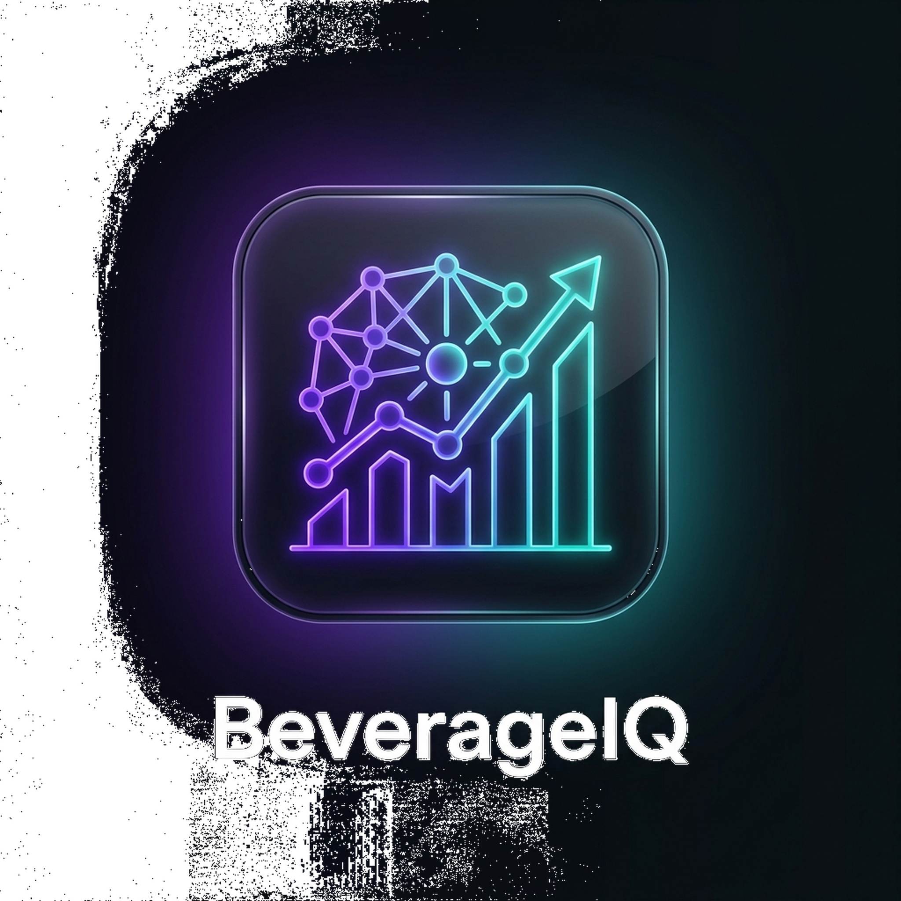
  
  # BeverageIQ 🥤
  
  **AI-Powered FMCG Business Analytics Assistant**
  
  [](https://python.org)
  [](https://streamlit.io)
  [](https://ollama.com)
  [](LICENSE)

</div>

<br/>

BeverageIQ is an enterprise-grade, **AI-powered Business Analytics Assistant** designed exclusively for the Fast-Moving Consumer Goods (FMCG) industry. It enables business executives to ask natural language questions about sales, promotions, inventory, and stores, instantly returning mathematically grounded analytics, interactive Plotly visualizations, and beautifully rendered Deloitte-style PDF executive reports.

**Crucially, BeverageIQ is completely immune to LLM hallucination.** It strictly uses Pandas DataFrames for data aggregation and only invokes the LLM (`llama3.2` running at `0.0` temperature) to provide business summarization over factual Database query results.

## 🌟 Key Features

- **Conversational Analytics**: Ask questions like *"Which promotion generated the highest revenue in the East region?"* and receive exact metrics, a visualization, and business recommendations.
- **Enterprise Dark Theme**: A highly professional, meticulously designed Streamlit user interface featuring glassmorphism and modern KPI layouts.
- **Zero-Hallucination Architecture**: Natural Language -> Intent parsing -> Secure Pandas Aggregation -> Plotly Render -> Llama 3 Summary.
- **ReportLab PDF Engine**: Dynamically generates multi-page, dark-themed PDF executive reports complete with risk indicators and native charts.
- **Lazy Loading**: High-performance dashboarding with cached database queries and lazy-evaluated heavy exports.

---

## 📸 High-Fidelity UI Gallery

| Executive Dashboard | Analytics Chat |
|:---:|:---:|
| 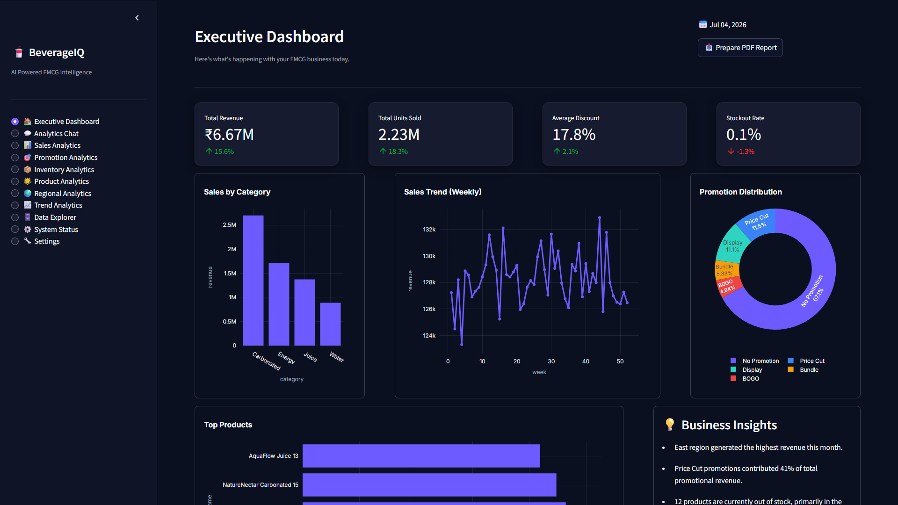 | 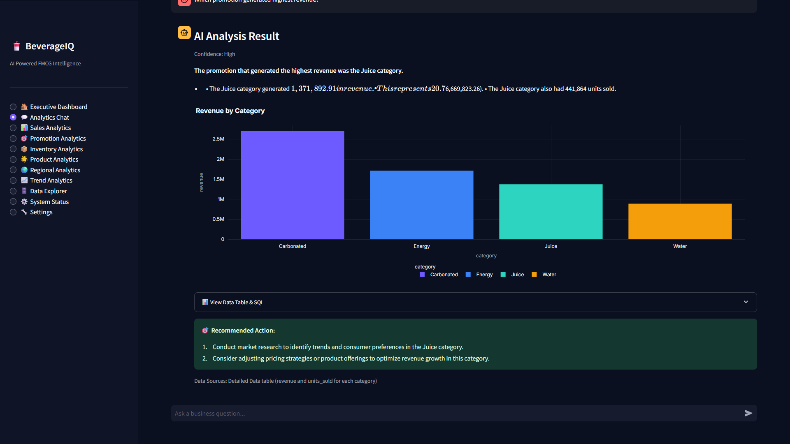 |

| Sales Analytics | Promotion Analytics |
|:---:|:---:|
| 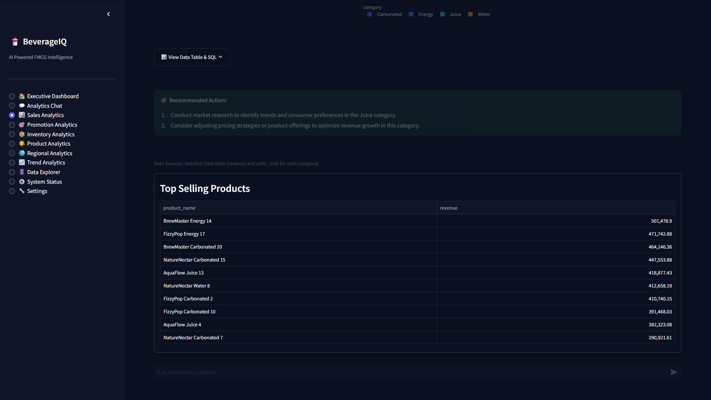 | 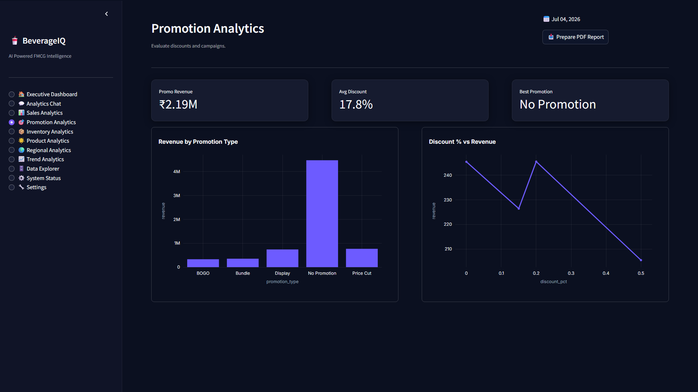 |

| Inventory (Risk Engine) | Regional Analytics |
|:---:|:---:|
| 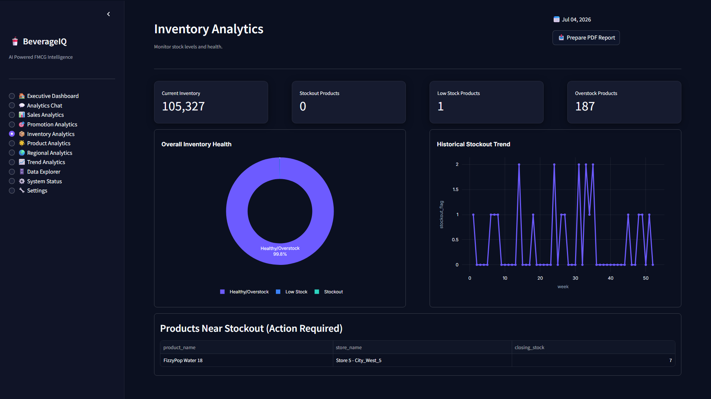 | 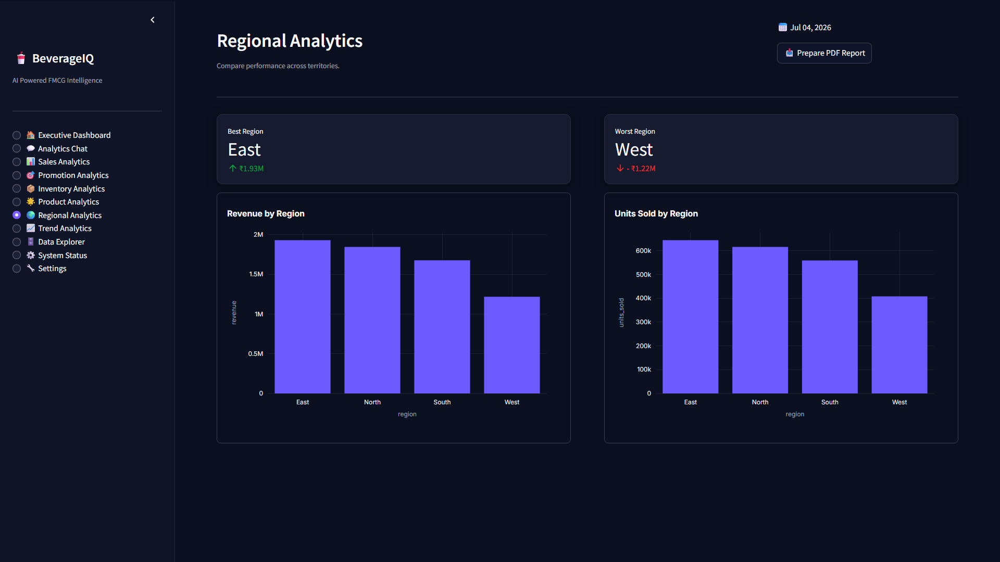 |

| Trend Analytics | Interactive Explorer |
|:---:|:---:|
| 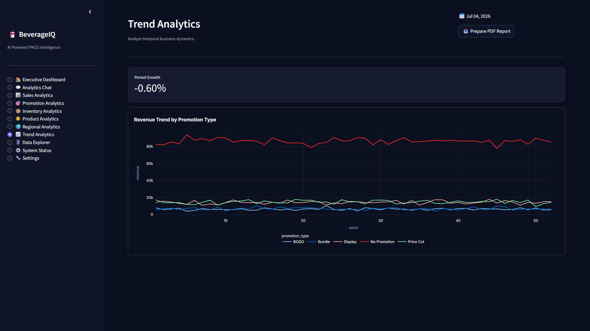 | 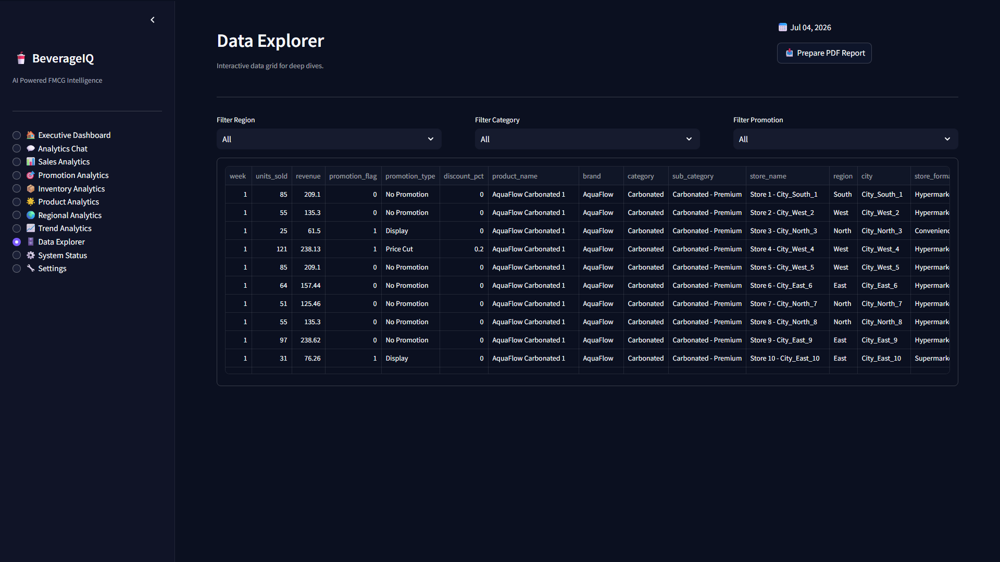 |

| System Status & LLM Health | Executive PDF (Deloitte Aesthetic) |
|:---:|:---:|
| 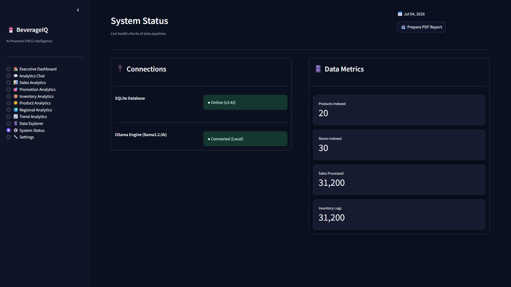 | 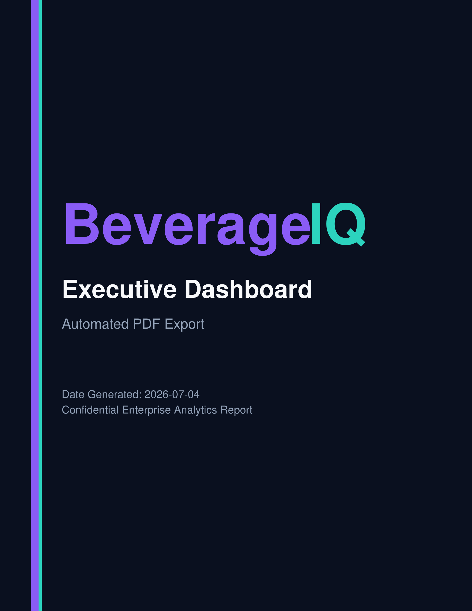 |

---

## 🏗️ Architecture

BeverageIQ operates on a strict linear pipeline ensuring that Large Language Models never touch or invent raw numbers.

<div align="center">
  
</div>

### Tech Stack
- **Frontend**: Streamlit, Custom CSS
- **Backend**: Python 3, Pandas, SQLite3
- **Visualization**: Plotly, Kaleido (Static Image Export)
- **AI/LLM**: Ollama (Llama 3.2:3b), Google Gemini API
- **Export Engine**: ReportLab (Vector PDF Generation)

---

## 📂 Repository Structure

```text
BeverageIQ/
├── app.py                   # Main Streamlit Application Entrypoint
├── config.py                # Global Constants & LLM Configuration
├── requirements.txt         # Clean Production Dependencies
├── .gitignore               # Strict Python/Streamlit Git Ignore
├── .env.example             # Local Environment Variables
│
├── assets/                  # Brand Assets (Logo, Favicon)
├── core/                    # Core Business Logic
│   ├── analytics.py         # Pandas Aggregation Engine
│   ├── charts.py            # Plotly Dark-Theme Generators
│   ├── database.py          # SQLite Connection Manager
│   ├── intent.py            # NLP Intent & Entity Parser
│   ├── llm.py               # Ollama Network Abstraction
│   ├── prompts.py           # Few-Shot LLM Templates
│   ├── sql_generator.py     # Safe Parameterized SQL Mapper
│   └── validator.py         # User Query Input Sanitization
│
├── utils/                   # Shared Utilities
│   ├── pdf_generator.py     # ReportLab Multi-Page Render Engine
│   ├── formatting.py        # Currency & Metric Formatting
│   └── export.py            # CSV/Excel Data Exporters
│
├── scripts/                 # Automation & Maintenance
│   ├── capture_screenshots.py # Playwright UI Tester
│   └── generate_dataset.py  # Mock FMCG Data Generator
│
├── data/                    # Production SQLite Warehouse
│   └── database.db
│
├── screenshots/             # High-Res UI Demos
├── docs/                    # Architecture SVGs & Diagrams
└── tests/                   # PyTest Suite
```

---

# 🌐 Live Demo

https://beverageiq-ai-f7dy57vygxqheusz8t82ow.streamlit.app/

---

## ⚙️ Installation & Usage

### 1. Prerequisites
- Python 3.10+
- [Ollama](https://ollama.com/) installed locally.

### 2. Configure AI Engine

BeverageIQ features a robust LLM abstraction layer with automatic failovers. You can use either **Ollama** (local, private) or **Google Gemini** (cloud, high-performance).

**Environment Variables** (Optional, set via `.env` or system variables):
```bash
LLM_PROVIDER="ollama"      # Choose 'ollama' or 'gemini' (default: ollama)
OLLAMA_MODEL="llama3.2:3b" # Local model to use
OLLAMA_HOST="http://localhost:11434"
GEMINI_API_KEY="your_api_key_here" # If provided while using Ollama, enables Auto-Fallback
```

#### Option A: Local Ollama (Default)
Ensure you have the required model pulled and running locally:
```bash
ollama run llama3.2:3b
```

#### Option B: Google Gemini API
Set `LLM_PROVIDER=gemini` and export your `GEMINI_API_KEY`. No local server is required.

### 3. Install Dependencies
Clone the repository and install the strict production requirements:
```bash
git clone https://github.com/yourusername/BeverageIQ.git
cd BeverageIQ
pip install -r requirements.txt
```

### 4. Launch the Dashboard
```bash
streamlit run app.py
```
Navigate to `http://localhost:8501`.

---

## 📊 Sample Queries

In the **Analytics Chat**, try asking:
- *"Show me stockout rate by region."*
- *"Which promotion generated highest revenue?"*
- *"Compare sales between brands."*
- *"What are the top 5 selling products?"*

---

## 📥 Executive PDF Generation

Every module inside BeverageIQ features an on-demand **Prepare PDF Report** button. 
BeverageIQ employs a proprietary 5-page **ReportLab Engine** that constructs gorgeous, native Dark-Mode PDFs containing:
1. Branded Cover Page
2. Massive KPI Grid (with Risk Parsing highlighting bad metrics in Red)
3. High-resolution Plotly Image dumps via Kaleido
4. AI-Generated Business Recommendations
5. Audit & Methodology Appendix

---

## 📄 License
This project is licensed under the MIT License.

## 🙌 Acknowledgements
Built exclusively using native Python, Streamlit, Pandas, SQLite, and Ollama. Engineered for modern, resilient, zero-hallucination Enterprise AI workflows.
